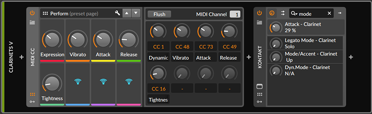
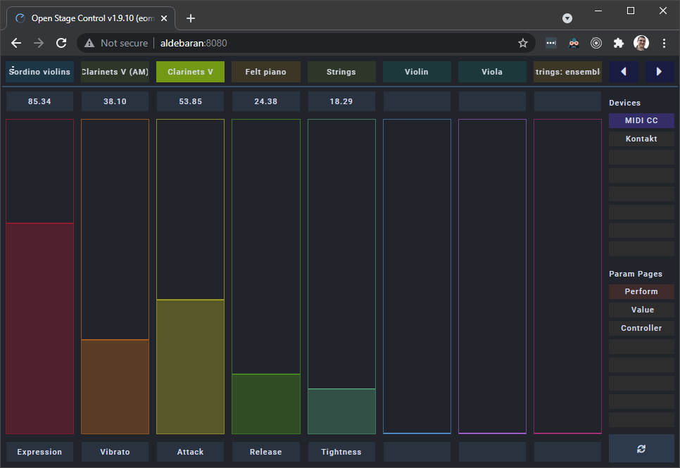

# EOM Device Controller Surface
A performance device parameters controller surface app on a browser for Bitwig Studio.

## Description
This is a set of files for configuring [Open Stage Control](https://openstagecontrol.ammd.net/), which then provides a browser app to control device parameters in [Bitwig Studio](https://www.bitwig.com/). This is an alternative to using a dedicated hardware controller panel with buttons or sliders. Best use is for a tablet, like the iPad, that you can put right next to your keyboard.

With a track selected ("Clarinets V" in the example), you can see the devices panel on Bitwig like in the following example:

With a device selected like that "MIDI CC" on the left, its params page is automatically shown on the EOM Device Controller Surface:

Now you can interact with the sliders!

The app also allows to:
- select tracks
- change track banks
- select devices within the selected track
- select param pages within the selected device
- resync with Bitwig

The app shows:
- track names and color
- device names
- param page names
- param values and colors

## How to install

Please use the instructions depicted on this sister project: https://github.com/akaztp/eom-launcher-surface

The only difference will be when configuring Open Stage Control:
- load: eom-device-controller-surface.json (point to the file you downloaded from this repo)

Check [CHANGELOG.md](./CHANGELOG.md) for history of changes and versions.
